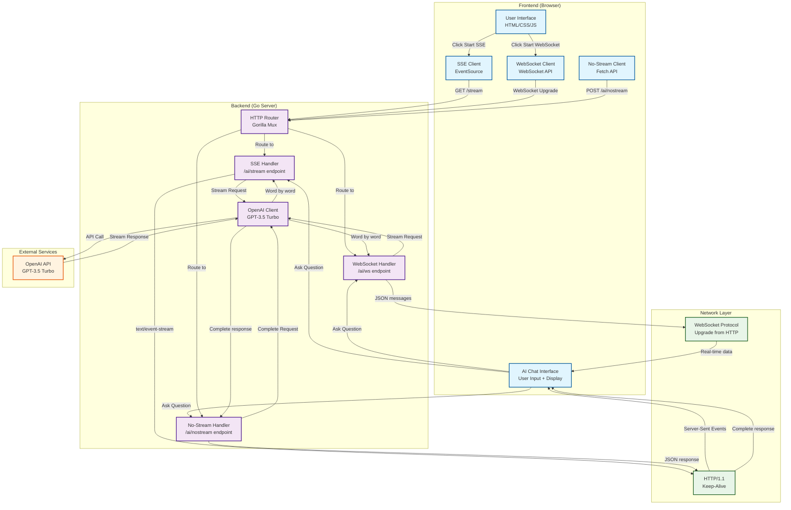

# Real-time AI Text Streaming Demo

This demo showcases real-time text streaming from a Go backend to a JavaScript frontend using three different communication protocols, with **real AI agent integration using OpenAI's GPT-3.5 Turbo**.

## 🚀 Features

- **Three Communication Protocols**:
  - **Server-Sent Events (SSE)**: Real-time streaming with automatic reconnection
  - **WebSocket**: Bidirectional real-time communication
  - **No Streaming**: Traditional request-response with word-by-word display effect
- **Real AI Integration**: OpenAI GPT-3.5 Turbo for actual AI responses
- **Comprehensive Timing**: Backend processing time + frontend display time + response time tracking
- **Response Time Measurement**: Track time from backend receipt to first letter appearance
- **Modern UI**: Beautiful, responsive interface with animations
- **Real-time Streaming**: Text appears word by word as it's generated
- **User Input Handling**: Ask questions and get AI responses in real-time
- **Error Handling**: Robust connection management and error recovery
- **Protocol Comparison**: Easily switch between different communication methods

## 📁 Project Structure

```
.
├── main.go              # Go backend server with OpenAI integration
├── go.mod               # Go module dependencies
├── static/
│   ├── index.html       # Main HTML page with demo links
│   ├── ai.html          # AI agent chat interface
│   ├── style.css        # Modern CSS styling
│   ├── script.js        # JavaScript for demo streaming
│   ├── ai.js            # JavaScript for AI agent interface
│   └── debug.html       # Simple debug page for testing
└── README.md           # This file
```

## 🏗️ System Architecture



## 🚀 Quick Start Tutorial

### Prerequisites
- **Go 1.21 or later** ([download](https://golang.org/dl/))
- **Modern web browser** (Chrome, Firefox, Safari, Edge)
- **OpenAI API key** ([get one here](https://platform.openai.com/api-keys))

### Step 1: Install Dependencies
```bash
go mod tidy
```

### Step 2: Set OpenAI API Key
```bash
export OPENAI_API_KEY=your_api_key_here
```

### Step 3: Start the Server
```bash
go run main.go
```

You should see:
```
Server starting on http://localhost:8080
AI Agent Demo: Available at http://localhost:8080/ai
OpenAI client initialized successfully
```

### Step 4: Open the Demo
1. Navigate to `http://localhost:8080`
2. Click "Try AI Agent Demo" or go directly to `http://localhost:8080/ai`

### Step 5: Test All Three Protocols
1. **SSE**: Click "Server-Sent Events (SSE)" - Real-time streaming
2. **WebSocket**: Click "WebSocket" - Bidirectional communication  
3. **No Streaming**: Click "No Streaming" - Complete response with word-by-word display
4. Type a question and watch the different behaviors!

## 🎯 Protocol Comparison

### Server-Sent Events (SSE)
- **Backend**: Streams words as they come from OpenAI
- **Frontend**: Displays words immediately as received
- **Response Time**: Measured from backend receipt to first letter display
- **Timing**: Real-time, no artificial delays
- **Best for**: Simple one-way streaming

### WebSocket
- **Backend**: Streams words as they come from OpenAI
- **Frontend**: Displays words immediately as received
- **Response Time**: Measured from backend receipt to first letter display
- **Timing**: Real-time, no artificial delays
- **Best for**: Bidirectional communication

### No Streaming
- **Backend**: Waits for complete OpenAI response
- **Frontend**: Displays complete response word-by-word (10ms delay)
- **Response Time**: Same as backend processing time (no streaming delay)
- **Timing**: Backend processing + frontend display effect
- **Best for**: Traditional request-response with visual appeal

## ⏱️ Timing Information

### What Gets Measured

**Response Time:**
- Time from backend receiving the question to first letter appearing in frontend
- Measures true user-perceived latency
- Includes network transmission time and frontend rendering

**Backend Processing Time:**
- Question receipt and parsing
- OpenAI API call
- Response generation
- Response preparation

**Frontend Display Time (No-Stream only):**
- Word-by-word display effect (10ms per word)
- Visual rendering time
- User interaction time

### Display Format
**For Stream mode:**
```
⏱️ Response completed in 2.34 seconds
⚡ First letter appeared in 1.12 seconds
```

**For No-Stream mode (detailed breakdown):**
```
⏱️ Timing Breakdown:
• Backend processing: 2.34s
• Visual display effect: 1.25s
• Total time: 3.59s
```

## 🔧 Troubleshooting

### Common Issues

**"OpenAI client not initialized" error:**
- Set `OPENAI_API_KEY` environment variable
- Restart server after setting API key
- Verify API key is valid

**"Address already in use" error:**
- Server already running on port 8080
- Navigate to `http://localhost:8080` directly

**"Connection refused" error:**
- Ensure server is running: `go run main.go`
- Check firewall settings for port 8080

**"API rate limit exceeded" error:**
- Wait before retrying
- Check OpenAI account usage
- Consider upgrading OpenAI plan

**No AI response appearing:**
- Verify OpenAI API key is set correctly
- Check server console for error messages
- Ensure OpenAI account has sufficient credits

## 💻 Implementation Details

### Backend (Go)

**AI SSE Handler:**
```go
func handleAISSE(w http.ResponseWriter, r *http.Request) {
    startTime := time.Now()
    
    // Parse user question
    var userQuestion UserQuestion
    json.NewDecoder(r.Body).Decode(&userQuestion)
    
    // Create OpenAI streaming request
    req := openai.ChatCompletionRequest{
        Model: openai.GPT3Dot5Turbo,
        Messages: []openai.ChatCompletionMessage{
            {Role: openai.ChatMessageRoleUser, Content: userQuestion.Question},
        },
        Stream: true,
    }
    
    // Stream response word by word
    stream, _ := openaiClient.CreateChatCompletionStream(ctx, req)
    firstContentTime := time.Time{}
    
    for {
        response, _ := stream.Recv()
        content := response.Choices[0].Delta.Content
        if content != "" {
            // Track first content received for response time
            if firstContentTime.IsZero() {
                firstContentTime = time.Now()
                responseTime := firstContentTime.Sub(startTime).Seconds()
                fmt.Fprintf(w, "data: [RESPONSE_TIME] %.2f\n\n", responseTime)
                w.(http.Flusher).Flush()
            }
            
            fmt.Fprintf(w, "data: %s\n\n", content)
            w.(http.Flusher).Flush()
        }
    }
}
```

**AI No-Stream Handler:**
```go
func handleAINoStream(w http.ResponseWriter, r *http.Request) {
    startTime := time.Now()
    
    // Create OpenAI non-streaming request
    req := openai.ChatCompletionRequest{
        Model: openai.GPT3Dot5Turbo,
        Messages: []openai.ChatCompletionMessage{
            {Role: openai.ChatMessageRoleUser, Content: userQuestion.Question},
        },
        Stream: false,
    }
    
    // Get complete response
    resp, _ := openaiClient.CreateChatCompletion(context.Background(), req)
    
    // Calculate timing
    duration := time.Since(startTime)
    
    // Return complete response with timing and response time
    json.NewEncoder(w).Encode(map[string]interface{}{
        "response":      resp.Choices[0].Message.Content,
        "timing":        duration.Seconds(),
        "response_time": duration.Seconds(), // Same as timing for No-Stream
    })
}
```

### Frontend (JavaScript)

**Response Time Tracking:**
```javascript
async sendQuestion() {
    // Start response time tracking
    this.responseStartTime = performance.now();
    this.firstLetterReceived = false;
    this.responseTime = null;
    
    // Send question based on protocol...
}

// Track first letter received in SSE
if (!this.firstLetterReceived && data.trim() !== '') {
    this.firstLetterReceived = true;
    const responseTime = (performance.now() - this.responseStartTime) / 1000;
    this.responseTime = responseTime;
}

// Display timing with response time
showTiming(timing) {
    let timingText = `⏱️ Response completed in ${timing.toFixed(2)} seconds`;
    
    // Add response time if available
    if (this.responseTime) {
        timingText += `<br>⚡ First letter appeared in ${this.responseTime.toFixed(2)} seconds`;
    }
    
    timingDiv.innerHTML = timingText;
}
```

**No-Stream Word-by-Word Display:**
```javascript
displayResponseWordByWord(fullResponse, timing) {
    const displayStartTime = performance.now();
    const words = this.splitIntoWords(fullResponse);
    let currentIndex = 0;
    
    const addNextWord = () => {
        if (currentIndex < words.length) {
            this.currentResponseElement.textContent += words[currentIndex];
            currentIndex++;
            setTimeout(addNextWord, 10); // 10ms delay
        } else {
            const displayDuration = (performance.now() - displayStartTime) / 1000;
            this.showDetailedTiming(timing, displayDuration);
        }
    };
    
    addNextWord();
}
```

## 🎯 Use Cases

This pattern is ideal for:

- **AI Chat Applications**: Real-time AI assistants and chatbots
- **AI Text Generation**: Stream responses from language models
- **Real-time Chat**: Live messaging applications with AI
- **Progress Updates**: Long-running AI task progress
- **Live Data Feeds**: AI-powered real-time data analysis
- **Protocol Comparison**: Testing different communication methods

## ✨ Key Advantages

1. **Better UX**: Users see responses immediately instead of waiting
2. **Protocol Flexibility**: Choose the best method for your use case
3. **Performance Insights**: Detailed timing breakdown including response time
4. **Real AI Integration**: Actual OpenAI GPT-3.5 Turbo responses
5. **Error Resilience**: Graceful handling of connection issues
6. **Visual Appeal**: Smooth word-by-word display effects
7. **Response Time Tracking**: Measure true user-perceived latency

## 🌐 Browser Support

- **SSE**: All modern browsers (IE 10+)
- **WebSocket**: All modern browsers (IE 10+)
- **Fetch API**: All modern browsers (IE 10+)

## 🏭 Production Considerations

- Add authentication and authorization
- Implement rate limiting for OpenAI API calls
- Add connection pooling for WebSockets
- Handle server restarts gracefully
- Add monitoring and logging for API usage
- Consider using a message queue for high-scale applications
- Implement proper error handling for API failures
- Add conversation history and context management
- Consider using different AI models based on use case
- Monitor response times for performance optimization

## 📚 Learning Resources

- [MDN - Server-Sent Events](https://developer.mozilla.org/en-US/docs/Web/API/Server-sent_events)
- [MDN - WebSocket](https://developer.mozilla.org/en-US/docs/Web/API/WebSocket)
- [OpenAI API Documentation](https://platform.openai.com/docs/api-reference)
- [Go WebSocket Documentation](https://pkg.go.dev/github.com/gorilla/websocket)
- [Go OpenAI Client](https://github.com/sashabaranov/go-openai)

---

**Happy AI streaming! 🚀🤖**
